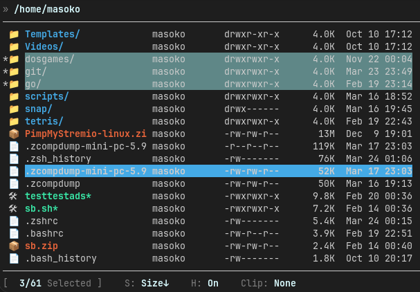

# Shell Buddy (`sb`)

A lightweight terminal file browser written in Bash.

`sb` gives you a fast, keyboard-driven way to move through directories, open files, and copy/paste items without leaving the terminal.

## Screenshot



## Features

- Fast keyboard navigation (`↑/↓`) through files and folders
- Page navigation with `PgUp`/`PgDn` and quick jump with `Home`/`End`
- Open directory with `→` or `Enter`; open files with smart preview (integrations when available)
- Go back with `←`
- Jump to home directory with `~`
- Multi-select items with `Insert` or `Space` (highlighted in magenta); `c`, `m`, and `d` operate on the whole selection
- Copy (`c`), paste (`v`), and move (`m`) files/directories — single item or multi-select
- Copy absolute path(s) of selected/current item to system clipboard with `Ctrl+C`
- Create a new file (`n`) or folder (`N`)
- Download a file from a URL into the current folder with `w`
- Delete selected item(s) with confirmation (`d`)
- Batch rename with `r` (uses `moreutils`/`vidir`): renames selected items, or all visible items when nothing is selected
- Toggle executable permission on selected item (`x`)
- Open selected file in `less` (`l`)
- Edit selected file in terminal editor (`e`)
- Open selected file/folder in GUI associated app (`o`)
- Toggle hidden files (`.`)
- Sort files with shortcuts: `Ctrl+N` (name asc/desc), `Ctrl+D` (date asc/desc), `Ctrl+S` (size asc/desc), `Ctrl+X` (extension asc/desc)
- Adjust name column width with `[` and `]`; jump directly to min/max with `{` and `}`
- Built-in help screen (`h`)
- Bookmark shortcuts via env vars (`0-9`) and bookmark list screen (`b`)
- Preserves cursor position per directory while navigating
- Shows current directory path in the header row
- If the current folder is inside a Git repo, shows `(branch)` in the header and appends `*` when there are unstaged changes
- Displays owner, permissions, size, and modified time
- Optional image preview in terminal (via `chafa`)
- Optional Markdown preview in terminal (via `glow`)
- Optional delimited-file preview in terminal (via `csvlens` for `.csv`, `.tsv`, `.tab`, `.psv`, `.dsv`)
- Optional JSON preview in terminal (via `jnv` for `.json`, `.jsonl`, `.ndjson`, `.geojson`)
- Optional archive content preview in terminal (via `ouch list` for archives like `.zip`, `.tar`, `.tar.gz`, `.tgz`, `.bz2`, `.xz`, `.rar`, `.7z`, `.gz`)
- Optional `.zip` archive browsing as folders (via `fuse-zip`; preferred when both `ouch` and `fuse-zip` are installed)
- Optional PDF text preview in terminal (via `pdftotext`; rendered with `bat` when available, otherwise `less`)
- Optional audio preview/playback in terminal (via `sox` for `.mp3`, `.wav`, `.ogg`, `.flac`, `.aac`, `.m4a`)
- Optional syntax-highlighted file preview (via `bat`)
- Optional fuzzy jump integration (via `fzf`, key `f`)
- Optional text search integration (via `rg`/ripgrep, key `g`)
- Optional side-by-side file comparison (via `delta`, key `C`)
- Optional disk usage analyzer (via `dust`) — toggle with `s` to display folder sizes and percentage of total directory size
- Optional batch renaming integration (via `moreutils` `vidir`)
- Optional SSH filesystem: browse remote hosts (via `sshfs`), press `S` for picker
- Auto-fallback opening behavior for GUI and headless systems
- UI adapts to terminal resize events
- Optional export of final directory path on exit


## Requirements

- Linux or Unix-like environment
- `bash`
- Core utils used by the script (`ls`, `cp`, `sed`, `awk`, `tput`, `stty`)
- Optional: `xdg-open` (for opening files in a graphical session)
- Optional: `wl-copy` (`wl-clipboard`) or `xclip` or `xsel` (for system clipboard path copy via `C`)
- One of `nano`, `vim`, `vi`, `less`, or another editor via `$EDITOR`/`$VISUAL` for headless servers
- Optional: `git` (for branch/status info in header)
- Optional: `chafa` (for inline image preview)
- Optional: `glow` (for Markdown preview)
- Optional: `csvlens` (for delimited-file preview)
- Optional: `jnv` (for JSON preview)
- Optional: `ouch` (for archive content preview)
- Optional: `fuse-zip` (for mounting and browsing `.zip` archives)
- Optional: `pdftotext` (for PDF text extraction/preview)
- Optional: `sox` (for audio preview/playback)
- Optional: `bat` (for syntax-highlighted file/PDF text preview)
- Optional: `fzf` (for fuzzy jump)
- Optional: `rg` / `ripgrep` (for in-app text search)
- Optional: `delta` (for side-by-side file comparison)
- Optional: `dust` (for disk usage analysis)
- Optional: `moreutils` (for batch rename via `vidir`)
- Optional: `sshfs` (for remote SSH filesystem mounts via `S` picker)

## Installation

### Option 1: One-command install

Install the latest release:

```bash
curl -fsSL https://raw.githubusercontent.com/hjelev/sb/master/install.sh | bash
```
or
```bash
curl -fsSL https://bit.ly/sb-install | bash
```

The installer detects Bash/Zsh and automatically adds an `sb()` shell function
to `~/.bashrc` or `~/.zshrc` so `sb` can return you to the last visited folder.

To skip shell integration:

```bash
curl -fsSL https://raw.githubusercontent.com/hjelev/sb/master/install.sh | bash -s -- --no-shell-setup
```

Install a specific version:

```bash
curl -fsSL https://raw.githubusercontent.com/hjelev/sb/master/install.sh | bash -s -- --version v0.1.0
```

By default this installs `sb` into the first writable directory already on your `PATH`.
If no writable `PATH` entry exists, it falls back to a user-local bin directory
(`$XDG_BIN_HOME`, `~/bin`, `~/.local/bin`, then `/usr/local/bin`) and, when shell setup is enabled,
adds a matching `PATH` export to your shell config automatically.
To use a different location:

```bash
curl -fsSL https://raw.githubusercontent.com/hjelev/sb/master/install.sh | SB_INSTALL_DIR=/usr/local/bin bash
```

The installer tries the latest GitHub release first and falls back to `master` or `main` until the first release exists.
When installing from a release tag (automatic latest release or `--version`), the installer also stamps that tag version into the installed `sb` script so `sb --version` matches the installed release.

### Uninstall

Remove `sb` and shell integration:

```bash
curl -fsSL https://raw.githubusercontent.com/hjelev/sb/master/install.sh | bash -s -- --uninstall
```

If you installed to a custom directory, pass the same location during uninstall:

```bash
curl -fsSL https://raw.githubusercontent.com/hjelev/sb/master/install.sh | SB_INSTALL_DIR=/usr/local/bin bash -s -- --uninstall
# or
curl -fsSL https://raw.githubusercontent.com/hjelev/sb/master/install.sh | bash -s -- --uninstall --install-dir /usr/local/bin
```

### Option 2: Run directly

```bash
chmod +x sb
./sb
```

### Option 3: Install in your PATH manually

```bash
chmod +x sb
sudo cp sb /usr/local/bin/sb
sb
```

### Option 4: Add `sb` as a shell function manually

If you skipped shell setup or use an unsupported shell, add this function manually.

For Bash (`~/.bashrc`) or Zsh (`~/.zshrc`):

```bash
sb() {
	if [ "$#" -gt 0 ]; then
		bash "/usr/local/bin/sb" "$@"
		return
	fi

	local tmp_file
	tmp_file=$(mktemp)
	bash "/usr/local/bin/sb" --export-path "$tmp_file"
	if [ -s "$tmp_file" ]; then
		cd "$(cat "$tmp_file")"
	fi
	rm -f "$tmp_file"
}
```

Then reload your shell:

```bash
source ~/.bashrc
# or
source ~/.zshrc
```

## Usage

Start in the current directory:

```bash
sb
```

Print the installed version:

```bash
sb --version
```

Update/reinstall `sb` in place using the installer:

```bash
sb --update
```

Start and export your last visited directory when quitting:

```bash
sb --export-path /tmp/last_dir.txt
```

Start with a custom initial name-column width:

```bash
sb -w 28
```

After you quit (`q`), the script writes the current working directory to the export file.

## Keybindings

| Key | Action |
|-----|--------|
| `↑` / `↓` | Move selection |
| `PgUp` / `PgDn` | Jump by one page |
| `Home` / `End` | Jump to top / bottom |
| `→` or `Enter` | Enter directory / smart preview with integrations |
| `←` | Go to parent directory |
| `~` | Jump to `$HOME` |
| `0-9` | Jump to `SB_BOOKMARK_0..SB_BOOKMARK_9` |
| `Insert` / `Space` | Toggle item selection (multi-select) |
| `*` | Select or deselect all items |
| `c` | Copy selected item(s) into clipboard |
| `Ctrl+C` | Copy absolute path(s) to system clipboard |
| `C` | Compare two selected files (delta) |
| `v` | Paste clipboard item(s) into current directory |
| `m` | Move selected item(s) into current directory |
| `n` | Create a new file |
| `N` | Create a new folder |
| `w` | Download URL into current directory |
| `g` | Search text with ripgrep |
| `i` | Show integration status |
| `l` | Open selected file in `less` |
| `e` | Edit selected file in CLI editor (`$VISUAL`/`$EDITOR` fallback chain) |
| `o` | Open selected item in GUI associated app |
| `x` | Toggle executable permission on selected item |
| `d` | Delete selected item(s) |
| `.` | Toggle hidden files |
| `Ctrl+N` | Sort by name (toggle ascending / descending) |
| `Ctrl+D` | Sort by date modified (toggle ascending / descending) |
| `Ctrl+S` | Sort by size (toggle ascending / descending) |
| `Ctrl+X` | Sort by extension (toggle ascending / descending) |
| `[` / `]` | Decrease / increase name column width |
| `{` / `}` | Set name column width to minimum / maximum |
| `h` | Show help screen |
| `b` | Show configured bookmarks from environment |
| `q` | Quit |

## Notes

- **Multi-select:** Press `Insert` or `Space` to toggle selection on any item — it is highlighted in magenta and marked with `*`. Press `c`, `m`, or `d` to copy, move, or delete all selected items at once. Selection is cleared automatically when navigating into a different directory.
- Press `Ctrl+C` to copy absolute path(s) to your desktop clipboard (selected items, or current item if none are selected) so you can paste after exiting `sb`.
- If a paste target name already exists, `sb` prompts for a new name for each conflicting item.
- For images (`jpg`, `png`, `gif`, etc.), `sb` uses `chafa` if available; otherwise it falls back to the normal file-open flow.
- **Bookmarks:** Configure with environment variables named `SB_BOOKMARK_0` through `SB_BOOKMARK_9` (for example `export SB_BOOKMARK_1="$HOME/Downloads"`). Press `0-9` to jump directly, or `b` to view configured bookmarks.
- On headless Linux systems, `sb` falls back to `$VISUAL`, `$EDITOR`, `sensible-editor`, `editor`, `nano`, `vim`, `vi`, `less`, or `more`.
- UI adapts to terminal resize events.

### Customizing Key Bindings

All keyboard shortcuts are configurable via environment variables with sensible defaults built in. If an environment variable is not set, `sb` uses the default keybinding.

**Custom keys:** Set any of these environment variables before running `sb`:

```bash
# Navigation
export SB_KEY_NAV_UP="$'\e[A'"           # Default: arrow up
export SB_KEY_NAV_DOWN="$'\e[B'"         # Default: arrow down
export SB_KEY_HOME="$'\e[H'"             # Default: Home key
export SB_KEY_END="$'\e[F'"              # Default: End key
export SB_KEY_PAGE_UP="$'\e[5~'"         # Default: PgUp
export SB_KEY_PAGE_DOWN="$'\e[6~'"       # Default: PgDn

# Main Navigation Actions
export SB_KEY_ENTER="$'\e[C'"            # Default: arrow right + Enter + Ctrl+M
export SB_KEY_EXIT="$'\e[D'"             # Default: arrow left (parent directory)
export SB_KEY_SELECT_TOGGLE=' '          # Default: Space + Insert + Alt+L

# Main Actions
export SB_KEY_HOME_DIR="~"               # Default: tilde
export SB_KEY_QUIT="q"                   # Default: q
export SB_KEY_HELP="h"                   # Default: h

# Selection & Operations
export SB_KEY_SELECT_ALL="*"             # Default: asterisk
export SB_KEY_COPY="c"                   # Default: c
export SB_KEY_COPY_ABSOLUTE="$'\x03'"    # Default: Ctrl+C
export SB_KEY_PASTE="v"                  # Default: v
export SB_KEY_MOVE="m"                   # Default: m
export SB_KEY_DELETE="d"                 # Default: d

# File Operations
export SB_KEY_CREATE_FILE="n"            # Default: n
export SB_KEY_CREATE_DIR="N"             # Default: N (uppercase)
export SB_KEY_RENAME="r"                 # Default: r
export SB_KEY_TOGGLE_EXEC="x"            # Default: x
export SB_KEY_DOWNLOAD="w"               # Default: w
export SB_KEY_EDIT="e"                   # Default: e
export SB_KEY_OPEN_GUI="o"               # Default: o
export SB_KEY_LESS="l"                   # Default: l

# Searching & Browsing
export SB_KEY_FZF_JUMP="f"               # Default: f (fuzzy find)
export SB_KEY_RIPGREP="g"                # Default: g (text search)
export SB_KEY_COMPARE_DELTA="C"          # Default: C (uppercase)
export SB_KEY_JUMP_PATH="$'\t'"          # Default: Tab

# Features
export SB_KEY_DUST_MODE="s"              # Default: s (disk usage)
export SB_KEY_INTEGRATIONS="i"           # Default: i (show status)
export SB_KEY_SSH_PICKER="S"             # Default: S (uppercase, SSH)
export SB_KEY_BOOKMARKS="b"              # Default: b
export SB_KEY_TOGGLE_HIDDEN="."          # Default: period

# Sorting
export SB_KEY_SORT_NAME="$'\x0e'"        # Default: Ctrl+N
export SB_KEY_SORT_DATE="$'\x04'"        # Default: Ctrl+D
export SB_KEY_SORT_SIZE="$'\x13'"        # Default: Ctrl+S
export SB_KEY_SORT_EXT="$'\x18'"         # Default: Ctrl+X

# Column Width
export SB_KEY_COLUMN_SHRINK="["          # Default: [
export SB_KEY_COLUMN_GROW="]"            # Default: ]
export SB_KEY_COLUMN_MIN="{"             # Default: {
export SB_KEY_COLUMN_MAX="}"             # Default: }
```

`sb` runs in terminal raw mode and maps `Ctrl+C` as a normal key while the UI is active; use `q` to quit.

**Example:** Vim-style customization:

```bash
export SB_KEY_NAV_UP="k"
export SB_KEY_NAV_DOWN="j"
export SB_KEY_EXIT="h"
export SB_KEY_ENTER="l"
export SB_KEY_HELP="?"
export SB_KEY_COMPARE_DELTA="C"
export SB_KEY_COPY_ABSOLUTE="$'\x03'"   # Ctrl+C
sb
```

- If files do not open in a GUI session, make sure `xdg-open` is available.
- On servers, set `$EDITOR` or install a terminal editor such as `nano` or `vim`.
- If image preview is not shown in terminal, install `chafa`.
- If colors/controls look wrong, try running in a standard terminal emulator with ANSI support.

## License

No license file is currently included in this repository.
