<p align="center">
  
</p>

<p align="center">
  <a href="https://crates.io/crates/shell-buddy"></a>
  <a href="https://crates.io/crates/shell-buddy"></a>
  <a href="https://github.com/hjelev/sb/releases"></a>
  <a href="https://github.com/hjelev/sb/actions/workflows/release.yml"></a>
  <a href="https://github.com/hjelev/sb/blob/master/LICENSE"></a>
  <a href="https://github.com/hjelev/sb/stargazers"></a>
</p>


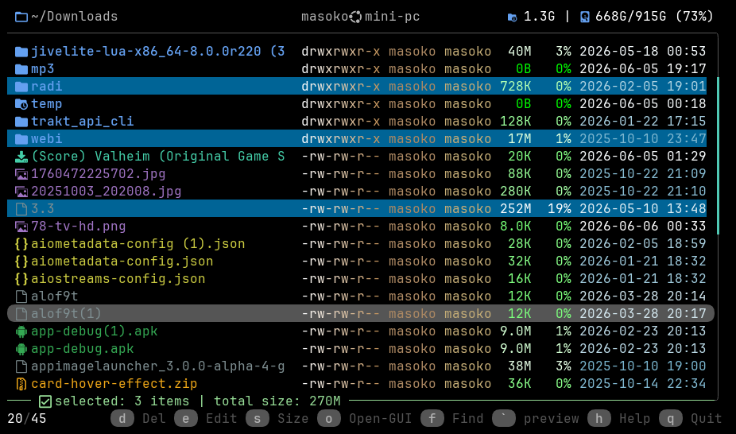

<details>
  <summary>Show screenshots</summary>
  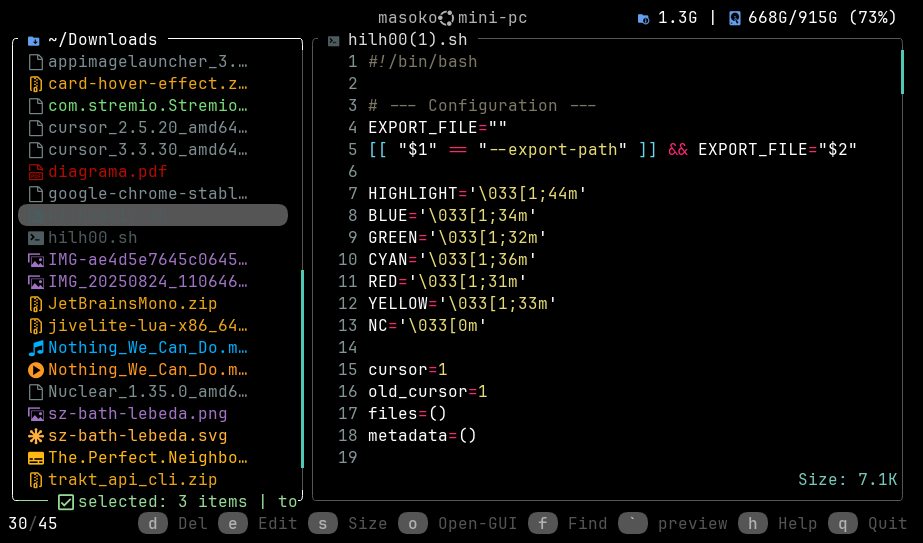
  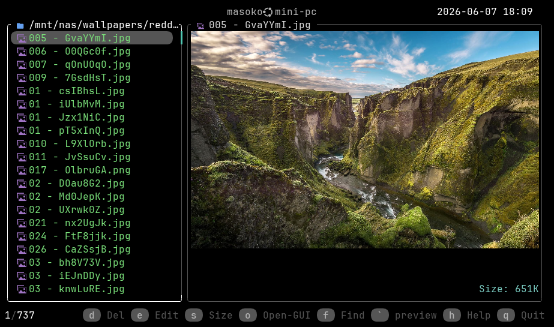
  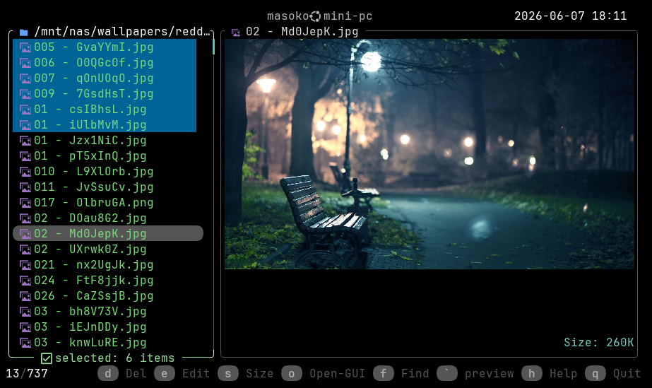
  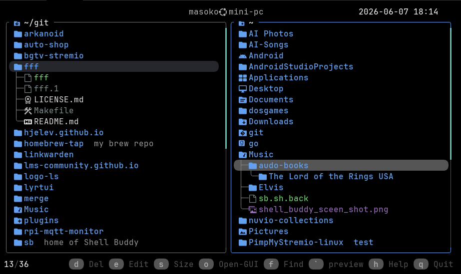
  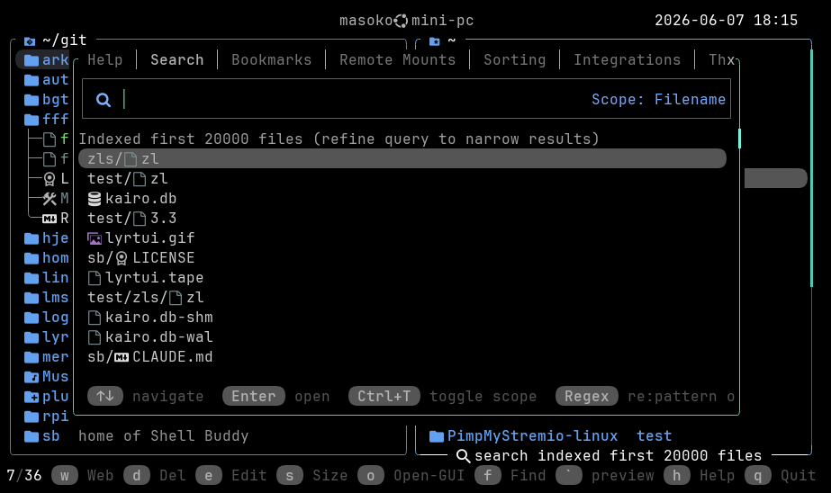
  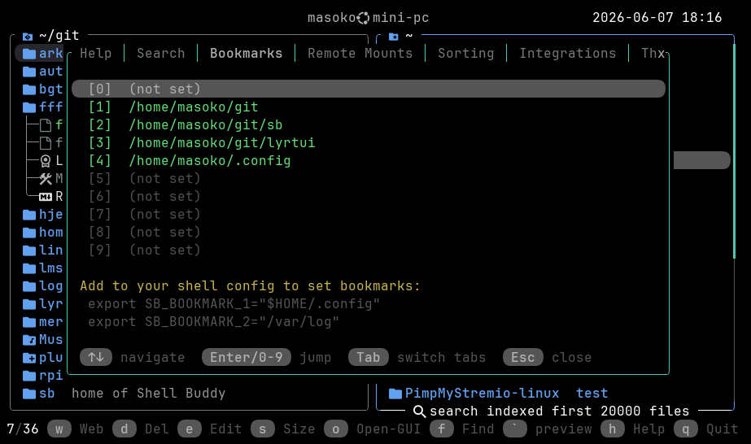
  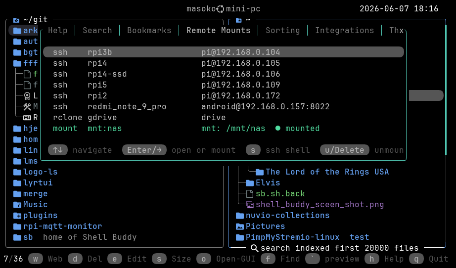
  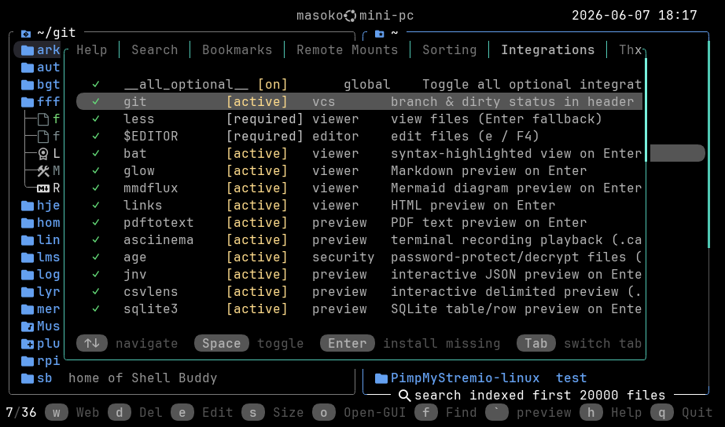
  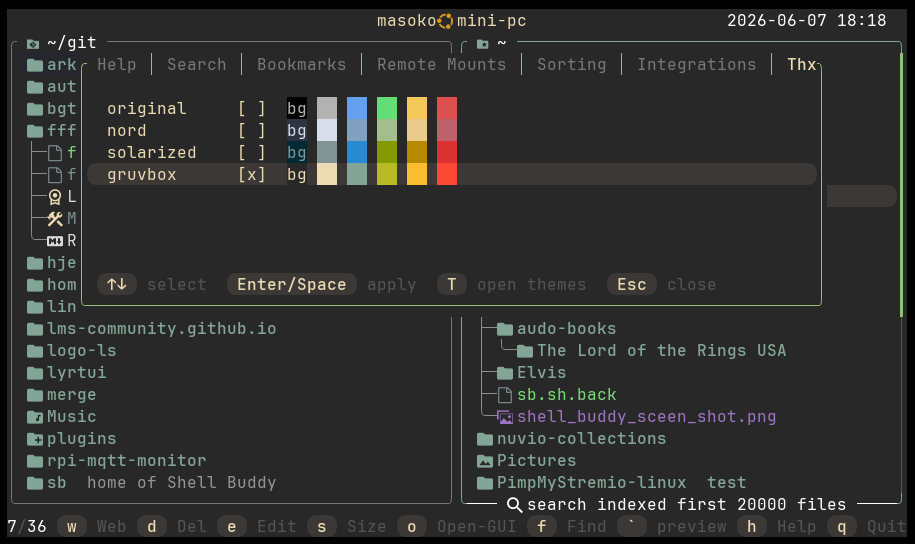
  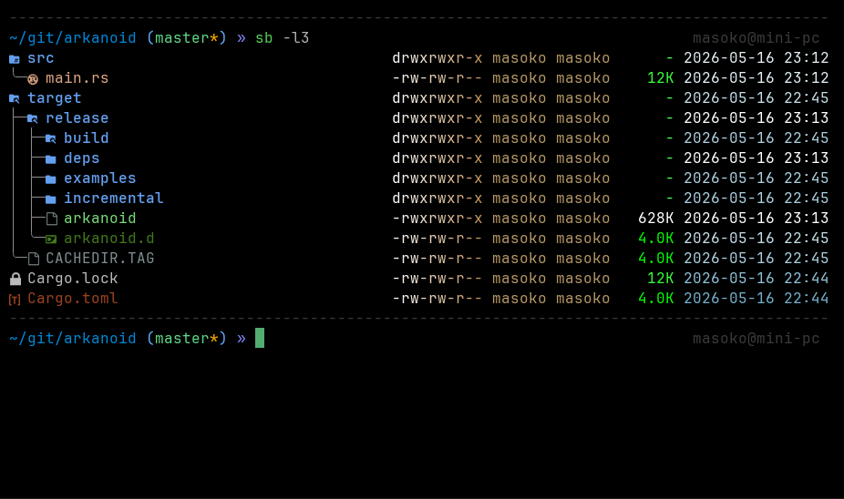
</details>

A terminal file manager (TUI) written in Rust using `ratatui` + `crossterm`.

`sb` (Shell Buddy) is a keyboard-driven explorer focused on fast local navigation with optional integrations for previews, archive handling, searching, remote mounts, and lightweight Git workflows.

## What sets sb apart

- **In-TUI Git workflow** — diff preview → status review → commit → push → optional tag, all without leaving the file manager (`G`)
- **Inline path filters** — type `^prefix`, `suffix$`, or `~contains` directly in the path bar to live-filter the listing (`Tab`)
- **Integration manager with one-key install** — see which optional tools are missing and install them via Homebrew without leaving the TUI (`I`)
- **Age encryption** — protect or decrypt `.age` files in-place with a single keypress (`p`)
- **Per-file notes** — attach notes to any file, stored in a hidden `.sb` file per directory (`Ctrl+n`)
- **tmux-aware splits** — `i` opens a shell + preview pane; `E` opens a shell + editor pane
- **Clipboard edit** — `Ctrl+e` opens the current clipboard contents in `$EDITOR` for quick manipulation
- **CLI list/tree modes** — `sb -l`, `sb -t`, `sb -l2` produce TUI-consistent column output; `sb <file>` skips the TUI and opens with the best available viewer

---

<details>
<summary><strong>Build and Run</strong></summary>

```bash
cargo build
cargo run
```

Release build:

```bash
cargo build --release
```

Release binary path:

```text
target/release/sb
```

List mode examples:

```bash
# Current directory
sb -l

# Include hidden entries
sb -a
sb -la

# Recursive display size + percent share columns
sb -l --total-size

# Full tree output
sb -t

# Tree output limited to depth 2
sb -l2
sb -l 2

# Path can appear before or after --total-size
sb -la /var/log --total-size
sb --total-size -l /var/log

# Open a file directly with the best available previewer/viewer
sb README.md
sb diagram.mmd

# Open a file with pager mode enabled
sb -l README.md

# Open a file in $EDITOR (fallback: nano)
sb -e README.md
```

</details>

<details>
<summary><strong>CLI List Mode</strong></summary>

- `-l [PATH]`: list directory entries and exit.
- `-a [PATH]`: same as `-l`, but includes hidden files.
- `-la [PATH]`: same as `-l`, but includes hidden files.
- `-e [FILE]`: open file in `$EDITOR` (fallback: `nano`) and exit.
- `-t [PATH]`: tree-list recursively (full depth) and exit.
- `-lN [PATH]` / `-l N [PATH]`: tree-list to depth `N` and exit.
- `--total-size`: when used with `-l`, `-a`, or `-la`, shows recursive display size for each entry and a `%` column with that entry's share of the listed total.

Notes:

- `PATH` is optional and can be placed after `-l`/`-a`/`-la` or after `--total-size`.
- The list output reuses the file manager's auto-calculated owner/group column widths for consistent alignment.
- When invoked as `sb <FILE>`, the app skips the TUI and opens the file directly with best-available viewer output (no pager).
- When invoked as `sb -l <FILE>`, direct file mode uses pager-enabled output.

</details>

<details>
<summary><strong>Installation</strong></summary>

### From crates.io

```bash
cargo install shell-buddy
```

### From Homebrew

```bash
brew install hjelev/tap/sb
```

### From Source

```bash
git clone https://github.com/hjelev/sb.git
cd sb
cargo install --path .
```

### From Releases

Prebuilt binaries and the auto-installer script are available in [GitHub Releases](https://github.com/hjelev/sb/releases).
Use the installer there if you want the fastest setup without building from source.

</details>

<details>
<summary><strong>Core Controls</strong></summary>

- `q` / `Esc`: quit
- `\``: toggle modes
- `Enter` / `Right`: open entry / preview file
- `Left` / `Backspace`: go to parent / leave mounted view
- mouse left-click: select clicked entry
- mouse double left-click: open clicked entry (same behavior as `Right`)
- mouse right-click: go to parent / leave mounted view (same behavior as `Left`)
- `Up`/`Down`/`PageUp`/`PageDown`/`Home`/`End`: navigation
- `Space`: mark/unmark current entry
- `*`: toggle all marks
- `c` or `F5`: copy to internal clipboard
- `Ctrl+c`: copy selected full path(s) to system clipboard
- `Ctrl+e`: edit system clipboard text in `$EDITOR`
- `v`: paste
- `m`: move (cut+paste behavior) from internal clipboard
- `d`: delete (with confirmation)
- `x`: toggle executable bit on selected file(s)
- `p`: protect/unprotect file with `age` (`.age`)
- `F2` or `r`: rename (or bulk rename with `vidir` when multiple are marked)
- `e` or `F4`: open in `$EDITOR` (or `hexedit` for binary if available)
- `E`: split tmux session with shell on the left and `$EDITOR` on the right (`Ctrl+e` is clipboard edit)
- `n`: new file or folder (folder starts with `/`)
- `Ctrl+n`: add/edit note for selected item(s)
- `t`: open `~/.todo` in `$EDITOR` (creates it if missing)
- `Z`: archive create/extract flow
- `C`: compare marked file vs cursor file with `delta`
- `G`: Git commit workflow with diff preview, `git status`, commit/push, and optional post-push tag creation
- `o`: open with system GUI opener (`open` on macOS, `xdg-open`/`gio open` elsewhere)
- `f`: open Search overlay (filename search; uses built-in search if `fzf` is missing)
- `g`: content search (`rg`, optional `fzf` handoff; falls back to built-in Search content mode when `rg` is missing)
- `;`: open command prompt, run shell command, then wait for keypress before returning to TUI
- `S`: SSH/rclone remote picker
- `i`: split shell (left) + `less` preview (right 30%)
- `I`: integrations panel
- `b`: bookmarks panel
- `Ctrl+z`: drop to interactive shell in current directory
- `Tab` (in browsing): edit current path inline; supports `/path/^prefix`, `/path/suffix$`, and `/path/~contains` filters
- `Tab` / `Shift+Tab` in Help/Search/Bookmarks/Remote Mounts/Sorting/Integrations: cycle tabs forward/backward
- `s`: toggle folder size calculation in listing
- `Ctrl+s`: open sort mode menu
- `+`: expand selected/marked non-empty folder(s) by one tree level
- `-`: contract selected/marked folder(s) by one tree level
- quick `++`: expand selected/marked non-empty folder(s) to max depth
- quick `--`: collapse all opened folders in tree view
- `0-9`: jump to bookmark (`SB_BOOKMARK_0..9`)
- `.`: toggle hidden files
- `~`: jump to home
- `h`: help overlay

</details>

<details>
<summary><strong>Search Overlay Functions</strong></summary>

When Search is open (`f` or fallback from `g`):

- `Up` / `Down`: move result selection
- `Enter`: open selected match
- `Esc`: close Search
- `Ctrl+t`: toggle scope between `Filename` and `Content`
- Query supports regex forms: `re:pattern` or `/pattern/i`
- Content-mode results render as `path:line` with highlighted matching snippets
- Content-mode scanning runs asynchronously (UI remains responsive)

Content limits editor (content scope):

- `Ctrl+l`: open/close limits editor
- `Up` / `Down`: select which limit to edit
- `Left` / `Right` or `-` / `+`: decrease/increase selected limit
- `Shift` + adjust: 10x step
- `r`: reset limits from environment/default values
- `Enter` / `Esc`: close limits editor

</details>

<details>
<summary><strong>Path Editing and Filters</strong></summary>

Press `Tab` while browsing to edit the current path in place.

- Enter a directory path and press `Enter` to jump there.
- Add a suffix filter to keep the current directory but narrow visible entries:
    - `/some/path/^foo`: names starting with `foo`
    - `/some/path/bar$`: names ending with `bar`
    - `/some/path/~baz`: names containing `baz`
- `Esc` from path-edit mode clears the active filter and returns to browsing.

The active filter remains visible in the header until you change directories.

</details>

<details>
<summary><strong>Git Workflow</strong></summary>

Press `G` in a Git working tree to:

- preview the current diff (`delta` side-by-side when available)
- view `git status`
- confirm whether to continue
- enter a commit message inside the TUI
- auto-run `git add --all`, `git commit`, and `git push origin HEAD`
- optionally press `t` immediately after a successful push to create and push a tag

When tagging, the tag input box is prefilled from the latest reachable Git tag when one exists.

</details>

<details>
<summary><strong>Integrations</strong></summary>

Required behavior:

- `less`: file viewing fallback
- `$EDITOR`: file editing command (defaults to `nano` if unset)

Optional integrations (auto-detected, toggle in `I` panel):

- In the Integrations panel, pressing `Enter` on a missing integration asks for confirmation and can install with Homebrew when available (macOS and Linux/Homebrew).

- VCS: `git`
- Viewers/previews: `bat`, `glow`, `mmdflux`, `jnv`, `csvlens`, `hexyl`, `chafa`, `viu`, `sox`, `pdftotext`, `asciinema`, `links`
- Diff/edit helpers: `delta`, `hexedit`, `vidir`, `tmux`
- Archives: `zip`/`unzip`, `tar`, `7z` family (`7z`/`7zz`/`7zr`), `rar`/`unrar`, `fuse-zip`, `archivemount`
- Security: `age`
- Remote mounts: `sshfs`, `rclone`
- Search: `rg`, `fzf`
- Clipboard backends: `wl-copy`/`wl-paste`, `xclip`, `xsel`, `pbcopy`/`pbpaste`

Remote picker (`S`) also lists existing local mounted folders discovered under:

- `/media/$USER`
- `/run/media/$USER`
- `/mnt`
- `/run/user/$UID/gvfs`

If an optional tool is not available, the feature is skipped or falls back gracefully.

</details>

<details>
<summary><strong>Environment Notes</strong></summary>

- `NERD_FONT_ACTIVE=1`: enable Nerd Font icons
- `NO_COLOR=1`: disable file name colors (modifiers like bold/dim still apply)
- `TERMINAL_ICONS=0`: hide all file icons (Nerd Font glyphs and emoji)
- `EDITOR`: editor command used by `e`/`F4`, `E`, `Ctrl+e`, and `t`
- `SB_BOOKMARK_0` ... `SB_BOOKMARK_9`: bookmark directories
- `SB_SEARCH_CONTENT_MAX_FILES`: built-in Search content-mode max files scanned (default: `20000`)
- `SB_SEARCH_CONTENT_MAX_HITS`: built-in Search content-mode max matches returned (default: `2000`)
- `SB_SEARCH_CONTENT_MAX_FILE_BYTES`: built-in Search content-mode per-file byte cap (default: `2097152` / 2 MiB)

</details>

<details>
<summary><strong>Shell Integration</strong></summary>

To enable automatic directory change on exit, add the following function to your shell configuration file (e.g., `~/.bashrc`, `~/.zshrc`):

```bash
sb() {
    "$HOME/.cargo/bin/sb" "$@"
    if [ -f /tmp/sb_path ]
    then
        cd "$(cat /tmp/sb_path)"
        rm -i -f /tmp/sb_path
    fi
}
```

After adding the function, reload your shell configuration:

```bash
source ~/.bashrc  # or source ~/.zshrc
```

</details>

<details>
<summary><strong>Project Structure</strong></summary>

Current code layout is modular:

- `src/main.rs`: app state, event loop, orchestration, and top-level workflows
- `src/app_input.rs`: input editing helpers
- `src/app_meta.rs`: permissions/owner/group metadata helpers
- `src/app_render_cache.rs`: entry render-cache generation
- `src/app_search.rs`: built-in search and path-filter matching helpers
- `src/app_files.rs`: file-type classification helpers
- `src/app_sizes.rs`: folder-size and aggregate-size scanning helpers
- `src/app_git.rs`: Git status/background cache helpers
- `src/app_archive.rs`: archive mount and preview lifecycle helpers
- `src/integration/`: integration catalog, probing, rows, and install flow
- `src/ui/`: CLI output, icons, panels, search spans, and status rendering
- `src/util/`: shared formatting helpers
- `Cargo.toml`: dependencies and release profile settings

</details>

<details>
<summary><strong>Dependencies</strong></summary>

From `Cargo.toml`:

- `ratatui` (UI)
- `crossterm` (terminal events/raw mode)
- `chrono` (timestamps)
- `devicons` (file icons)
- `hostname` (header prompt)
- `users` (owner metadata)
- `clap` (present as dependency)
- `regex` (search regex mode)
- `rayon` (parallel entry render-cache build)
- `unicode-width` (display-width-aware list-mode alignment)

</details>
